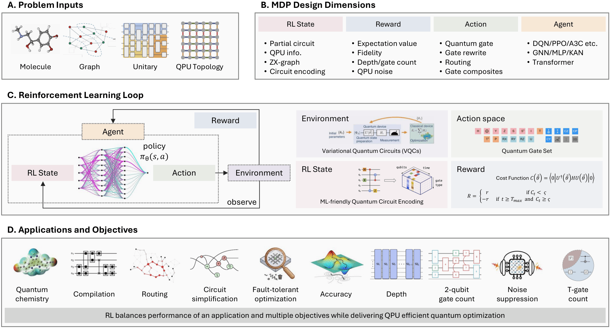
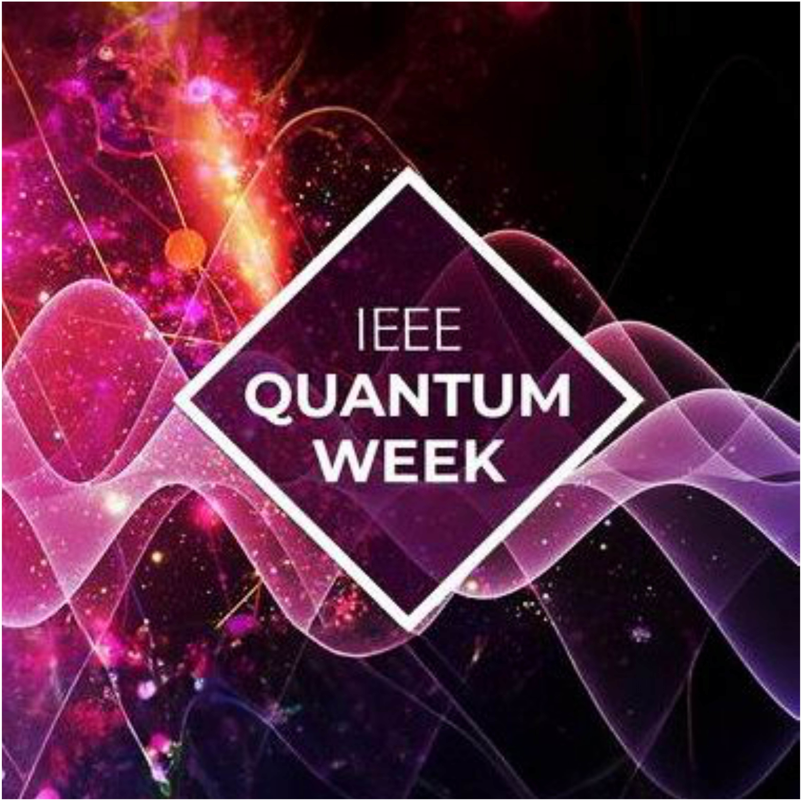
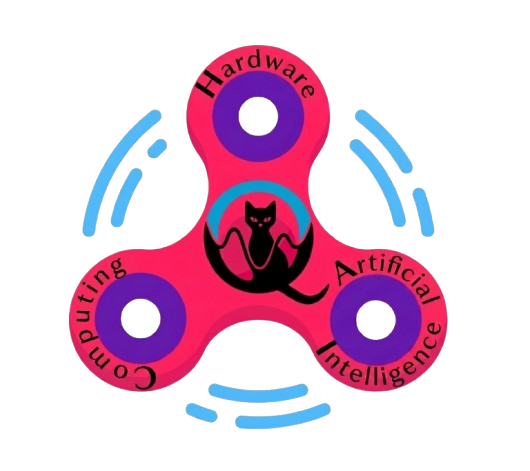

# Hands-on RL-QAS ✍️

## IEEE Quantum Week Tutorial on RL-QAS
  <!-- Left logo -->
  

    
    <b>A</b> <b>T</b>utorial on <b>R</b>einforcement <b>L</b>earning for <b>Q</b>uantum <b>A</b>rchitecture <b>S</b>earch @ <b>IEEE</b> <b>Q</b>uantum <b>W</b>eek
    
  
