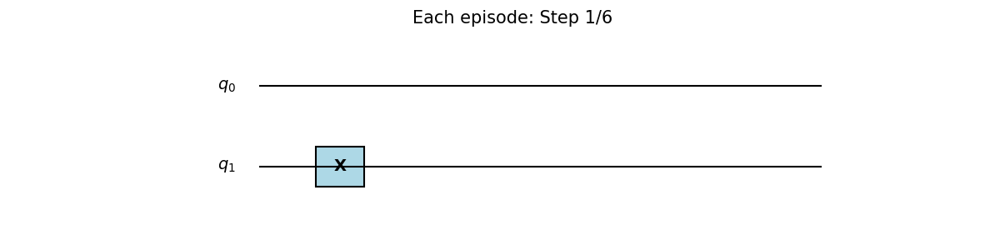
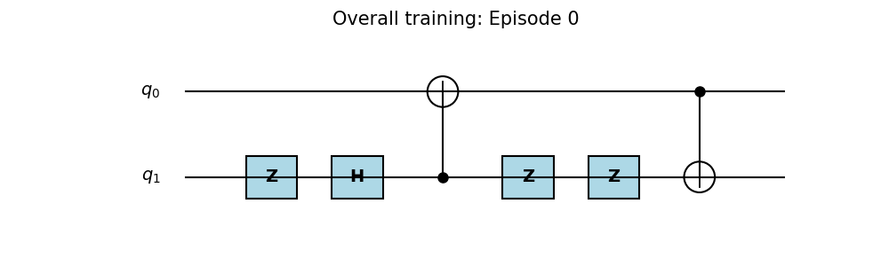
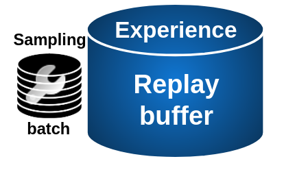
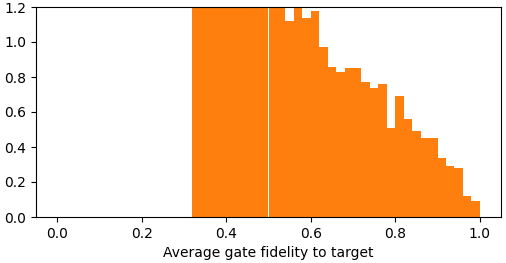
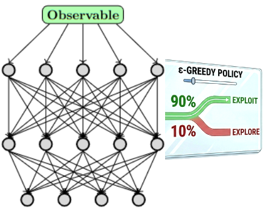
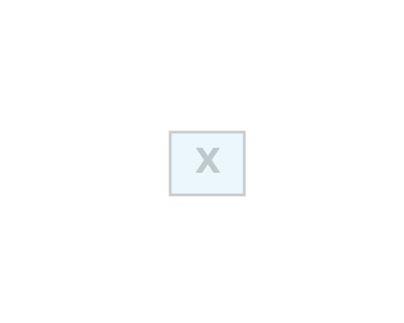

# Hands-on RL-QAS ✍️
 [](https://github.com/ellerbrock/open-source-badges/)

> **Review Paper:** [<u>Akash Kundu</u>, Aritra Sarkar, Prayag Tiwari, and <u>Sebastian Feld</u>. "Reinforcement Learning for Quantum Circuit Optimization: A Review." Openreview (2026).](https://openreview.net/forum?id=h6w1j1fjeZ)

> **Star (⭐️) my open-source QAS Repo:** [Awesome-QAS](https://github.com/Aqasch/awesome-QAS)

> **The Schedule @ Official Website:** [Website](https://aqasch.github.io/rlqas.github.io/)

<!--  -->

## RL-QAS Workflow
#### (a) Environment

<!-- <p style="text-align: center; font-size: 3rem;">↓</p> -->
<p align="center", font-size: 10rem>⬇</p>
<p align="center", font-size: 10rem>⬇</p>
<!-- <p style="text-align: center; font-size: 2rem;">↓</p> -->

#### (b) One Episode
<p align="center">
  
</p>
<!-- <p style="text-align: center; font-size: 2rem;">↓</p> -->
<p align="center", font-size: 10rem>⬇</p>
<p align="center", font-size: 10rem>⬇</p>

#### (c) Replay buffer
<p align="center">
  
  <!-- tune the focal point: horizontal vertical -->

</p>
<!-- <p style="text-align: center; font-size: 2rem;">↓</p> -->
<p align="center", font-size: 10rem>⬇</p>
<p align="center", font-size: 10rem>⬇</p>


#### (d) Sampling from buffer
<p align="center">
  
</p>
<p align="center", font-size: 10rem>⬇</p>
<p align="center", font-size: 10rem>⬇</p>
<p align="center">

</p>
<p align="center", font-size: 10rem>⬇</p>
<p align="center", font-size: 10rem>⬇</p>

<p align="center">
  <strong>Goes back to step (a) Environment</strong><br><br>
  
</p>


## IEEE Quantum Week Tutorial on RL-QAS
  <!-- Left logo -->
  <div style="flex: 0 0 auto;">
    
    <b>T</b>utorial on <b>R</b>einforcement <b>L</b>earning for <b>Q</b>uantum <b>A</b>rchitecture <b>S</b>earch @ <b>Q</b>uantum <b>W</b>eek
    
  </div>

## The dependencies
```
conda create -n tutorial python=3.10
conda activate tutorial
```

### Install the following few dependencies listed below:

```
pip install notebook
pip install qiskit
pip install qiskit_aer
pip install torch
pip install matplotlib
```

### Open jupyter notebook

On Terminal

```
jupyter notebook
```

## File description

**Noiseless** maximally entangled quantum state preparation:
```
RL-QAS_nonparameterized.ipynb
```

**Noisy** maximally entangled quantum state preparation:
```
RL-QAS_nonparameterized_noise.ipynb
```

Lightweight transfer learning by buffer transfer method:

> **Based on:** [<u>Akash Kundu</u>, and <u>Sebastian Feld</u>. "Replay-buffer engineering for noise-robust quantum circuit optimization." arXiv preprint arXiv:2604.21863 (2026).](https://arxiv.org/abs/2604.21863)

```
RL-QAS_lightweight_buffer_transfer.ipynb
```
